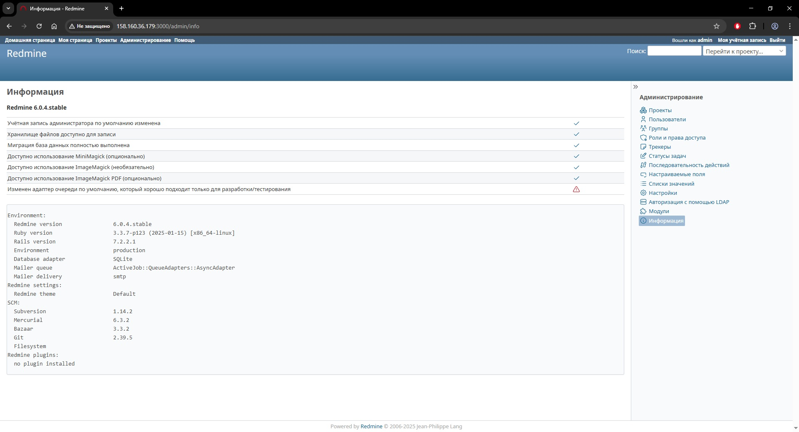

## 1. Ansible-роль 'redmine' для развертывания Redmine и PostgreSQL в Docker-контейнерах

### Сделано
1. Исправлены замечания ревьюера, указанные в комментарии к PR

### Скриншот


---
## 2. Ansible-роль 'redmine-cluster' для развертывания Redmine и кластера из master- и slave-инстансов PostgreSQL под управлением Patroni и HashiCorp Consul в Docker-контейнерах

### Сделано
1. Реализован запуск отказоустойчивого кластера PostgreSQL (master- и slave-инстансы) под управлением Patroni
2. Настроен HashiCorp Consul как backend для хранения конфигурации кластера
3. Обеспечено автоматическое переключение ведущего узла в случае сбоя

### Следующий шаг
1. Предстоит написать Ansible-таски для миграции данных из базы одиночного инстанса PostgreSQL в кластер PostgreSQL

---
## 3.1. Ansible-роль 'redmine-monitoring' для развертывания Prometheus и Grafana в Docker-контейнерах с целью мониторинга кластера из трех инстансов PostgreSQL под управлением Patroni и HashiCorp Consul

### Сделано
1. Исправлены замечания ревьюера, указанные в комментариях к предыдущему PR
2. Запущены два агента pgSCV для сбора метрик с инстансов Patroni и PostgreSQL https://github.com/cherts/pgscv/wiki/
3. Сконфигурированы Prometheus и Grafana для хранения и отображения метрик и дашбордов
4. В Grafana добавлены два дашборда "pgSCV: Patroni (NEW)" и "pgSCV: PostgreSQL (NEW)"

### Следующий шаг
1. Предстоит задействовать модуль pg_stat_statements для сбора более полного набора метрик
https://www.postgresql.org/docs/current/pgstatstatements.html

---
## 3.2. Ansible-роль 'redmine-victoriametrics'

### Сделано
1. Prometheus заменен на VictoriaMetrics
2. Задействован модуль pg_stat_statements

---
## 4.1. Ansible-роль 'redmine-cluster-scale-out' для расширения кластера до пяти инстансов PostgreSQL под управлением Patroni и HashiCorp Consul

### Сделано
1. Количество инстансов PostgreSQL под управлением Patroni и HashiCorp Consul доведено до пяти

---
## 4.2. Ansible-роль 'redmine-pgbouncer-haproxy' для развертывания PgBouncer и HAProxy

### Сделано
1. Развернуты 5 инстансов пулера соединений PgBouncer для каждого экземпляра PostgreSQL
2. Настроен балансировщик нагрузки HAProxy:
    - dbrw.haproxy.service.redmine:5432 - для чтения\записи (Redmine)
    - dbrw.haproxy.service.redmine:5433 - только для чтения (для целей тестирования)
3. Приложение Redmine переключено на работу с БД через HAProxy

---
## 4.3. Ansible-роль 'redmine-expand-victoriametrics' для расширения мониторинга

### Сделано
1. Настроен мониторинг для всех пяти инстансов PostgreSQL
2. Запущен еще один агент pgSCV для сбора метрик с инстансов PgBouncer
3. В Grafana добавлен дашборд "pgSCV: Pgbouncer (NEW)"

### Требования

- Ansible 2.17+
- ОС удаленного хоста: Ubuntu 24.04

### Запуск развертывания
```bash
ansible-playbook playbook1.yml
ansible-playbook playbook2.yml
ansible-playbook playbook3.yml
ansible-playbook playbook4.yml
```

---
**Работу выполнил:** Алексей Свинухов
