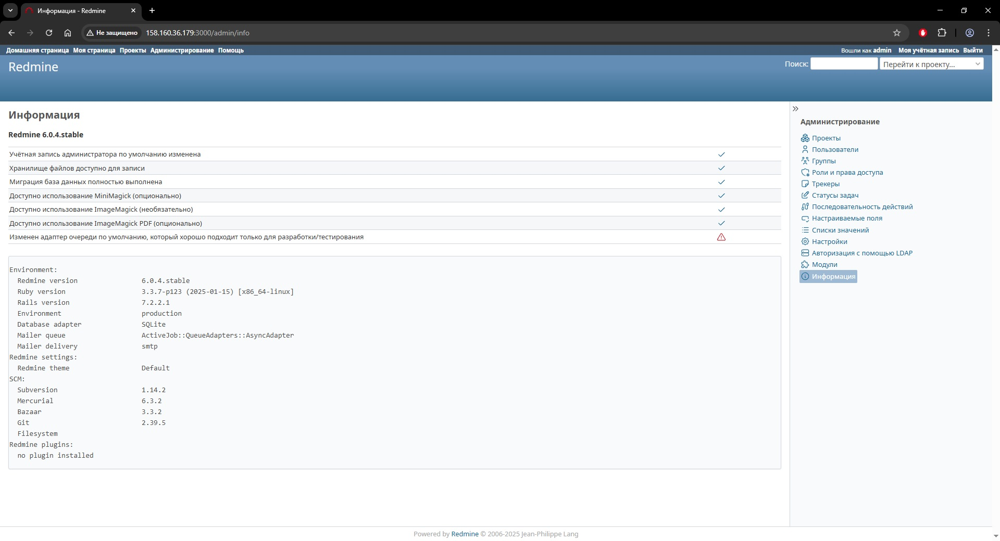

# 1. Ansible-роль 'redmine' для развертывания Redmine и PostgreSQL в Docker-контейнерах

## Сделано
1. Исправлены замечания ревьюера, указанные в комментарии к PR

## Требования

- Ansible 2.17+
- Доступ к удаленному хосту (авторизация по SSH-ключу)
- ОС удаленного хоста: Ubuntu 24.04

## Запуск развертывания
```bash
ansible-playbook playbook.yml
```
## Скриншот


---
# 2. Ansible-роль 'redmine-cluster' для развертывания Redmine и кластера из master- и slave-инстансов PostgreSQL под управлением Patroni и HashiCorp Consul в Docker-контейнерах

## Сделано
1. Реализован запуск отказоустойчивого кластера PostgreSQL (master- и slave-инстансы) под управлением Patroni
2. Настроен HashiCorp Consul как backend для хранения конфигурации кластера
3. Обеспечено автоматическое переключение ведущего узла в случае сбоя

## Следующий шаг
1. Предстоит написать Ansible-таски для миграции данных из базы одиночного инстанса PostgreSQL в кластер PostgreSQL

## Требования

- Ansible 2.17+
- Доступ к удаленному хосту (авторизация по SSH-ключу)
- ОС удаленного хоста: Ubuntu 24.04

## Запуск развертывания
```bash
ansible-playbook playbook.yml
ansible-playbook playbook-2.yml
```

---
**Работу выполнил:** Алексей Свинухов
